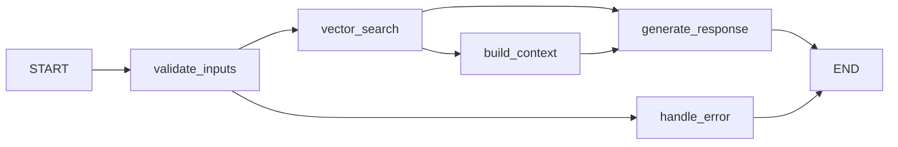

# RAG Pipelines Architecture - LangGraph Implementation

This directory contains the modular RAG (Retrieval-Augmented Generation) pipeline architecture that follows Clean Architecture principles and is powered by LangGraph workflows.

## Architecture Overview

The RAG system has been refactored with LangGraph workflow orchestration:

```
aiLangchainAdapter.js (LangGraph Coordinator)
    │
    ├── LangGraph RAG Workflow (Graph-based Processing)
    │   ├── validate_inputs → vector_search → build_context → generate_response
    │   ├── Conditional routing based on state
    │   ├── Error handling with fallback nodes
    │   └── State management across workflow execution
    │
    ├── DataPreparationPipeline.js (Heavy Operations)
    │   ├── Repository cloning
    │   ├── Document loading and processing
    │   ├── Text chunking and splitting
    │   ├── Vector embedding generation
    │   ├── Pinecone vector storage
    │   └── Core documentation indexing
    │
    └── QueryPipeline.js (Reusable Components)
        ├── Vector similarity search
        ├── Context retrieval and formatting
        ├── Conversation history integration
        ├── LLM response generation
        └── Fallback response handling
```

## LangGraph Migration Benefits

### 🎯 **Graph-Based Workflow**
- **State Management**: Centralized state handling with proper reducers
- **Conditional Routing**: Dynamic workflow paths based on execution results  
- **Error Recovery**: Dedicated error handling nodes with graceful fallbacks
- **Visibility**: Clear workflow visualization and debugging capabilities

### 🔧 **Node-Based Architecture**


## Components

### 1. AILangchainAdapter (LangGraph Coordinator)

**NEW**: Now implements LangGraph StateGraph for workflow orchestration:

```javascript
// LangGraph workflow nodes
- validate_inputs: Parameter validation and vector store setup
- vector_search: RAG retrieval using existing orchestrator
- build_context: Format search results into context
- generate_response: LLM response generation with fallbacks  
- handle_error: Error handling and graceful degradation
```

**Features:**
- Graph-based workflow execution
- State-aware processing with proper reducers
- Conditional routing between nodes
- Comprehensive error handling
- Maintains backward compatibility

### 2. LangGraph Workflow State

**State Schema:**
```javascript
{
  userId: string,
  conversationId: string, 
  prompt: string,
  conversationHistory: array,
  vectorStore: PineconeStore,
  searchResults: array,
  contextData: object,
  response: string,
  error: string,
  metadata: object  // Workflow execution metadata
}
```

**State Management:**
- **Reducers**: Proper state merging with spread operators
- **Defaults**: Sensible default values for all state fields
- **Immutability**: State updates preserve existing data
- **Metadata**: Rich tracking of workflow execution details

### 3. DataPreparationPipeline (Heavy Operations)

Unchanged - continues to handle computationally expensive, one-time operations:

**Key Methods:**
- `processPushedRepo(userId, repoId, repoData)` - Main entry point
- `indexCoreDocsToPinecone()` - Index API spec and markdown docs
- `cloneRepository(url, branch)` - Git clone operations
- `loadAndProcessRepoDocuments()` - Document processing
- `cleanupTempDir()` - Temporary file cleanup

### 4. QueryPipeline Components (Reusable)

Now used as utility components within LangGraph nodes:
- **VectorSearchOrchestrator**: Multi-namespace vector search
- **ContextBuilder**: Format search results into context
- **ResponseGenerator**: LLM interaction with retry logic

## Data Flow

### Repository Processing (Data Preparation)
```
User pushes repo → AIService → AILangchainAdapter → DataPreparationPipeline
    │
    ├── Index core docs (API spec, markdown)  
    ├── Clone repository
    ├── Load and process documents
    ├── Generate embeddings
    ├── Store in Pinecone (user namespace)
    └── Cleanup temporary files
```

### Query Processing (LangGraph Workflow)
```
User sends prompt → AIService → AILangchainAdapter → LangGraph Workflow
    │
    ├── [validate_inputs] Parameter validation & vector store setup
    ├── [vector_search] Multi-namespace similarity search  
    ├── [build_context] Format retrieved documents into context
    ├── [generate_response] LLM response with conversation history
    └── [handle_error] Graceful error handling if needed
```

## LangGraph Implementation Details

### Workflow Initialization
```javascript
initializeLangGraphWorkflow() {
  // Define state schema with Annotation
  const RagState = Annotation.Root({
    userId: Annotation({ reducer: (x, y) => y ?? x }),
    // ... other fields
  });
  
  // Create and configure graph
  this.ragGraph = new StateGraph(RagState);
  this.ragGraph.addNode("validate_inputs", this.validateInputsNode);
  // ... add other nodes and edges
  
  this.compiledRagGraph = this.ragGraph.compile();
}
```

### Node Implementation Pattern
```javascript
async validateInputsNode(state) {
  console.log('🔍 LangGraph: Validating inputs');
  
  if (!state.userId || !state.prompt) {
    return {
      ...state,
      error: "Missing required parameters",
      metadata: { ...state.metadata, validation: "failed" }
    };
  }
  
  // Setup vector store if needed
  if (this.pinecone && !state.vectorStore) {
    const vectorStore = new PineconeStore(/* ... */);
    return { ...state, vectorStore, metadata: { ...state.metadata, validation: "passed" } };
  }
  
  return { ...state, metadata: { ...state.metadata, validation: "passed" } };
}
```

### Conditional Routing
```javascript
routeAfterValidation(state) {
  if (state.error) return "handle_error";
  return "vector_search";
}

routeAfterSearch(state) {
  if (state.error) return "handle_error";
  if (state.searchResults?.length > 0) return "build_context";
  return "generate_response"; // Standard response without RAG
}
```

## Migration Impact

### ✅ **Preserved Functionality**
- All existing method signatures maintained
- Return value formats unchanged
- Event emission patterns preserved
- Logging consistency maintained
- Error handling behavior preserved

### 🚀 **Enhanced Capabilities**  
- **Workflow Visibility**: Clear execution path tracking
- **State Management**: Proper state handling with reducers
- **Error Recovery**: Dedicated error handling workflows
- **Conditional Logic**: Dynamic routing based on execution results
- **Metadata Tracking**: Rich workflow execution metadata

### 🔧 **Performance Benefits**
- **Compiled Workflows**: One-time compilation for better performance
- **State Efficiency**: Minimal state copying with proper reducers
- **Error Short-Circuiting**: Fast error handling without full pipeline execution
- **Conditional Execution**: Skip unnecessary nodes based on state

## Configuration

### Environment Variables
```bash
# Required for vector operations
PINECONE_API_KEY=your_key
PINECONE_INDEX_NAME=your_index
OPENAI_API_KEY=your_key

# Optional  
PINECONE_ENVIRONMENT=your_env
```

### LangGraph Workflow Options
```javascript
// Workflow state is automatically managed
// No additional configuration needed
// State schema defined via Annotation.Root()
```

## Error Handling

### Enhanced Error Handling with LangGraph
- **Dedicated Error Node**: `handle_error` node for centralized error handling
- **State-Aware Errors**: Error context preserved in workflow state  
- **Graceful Fallbacks**: Automatic routing to fallback responses
- **Error Metadata**: Rich error tracking in workflow metadata

### Conditional Error Recovery
```javascript
// Automatic routing based on error state
if (state.error) {
  // Route to error handling node
  return "handle_error";
}
// Continue with normal workflow
return "next_node";
```

## Usage Examples

### Processing a Repository (Unchanged)
```javascript
const result = await aiAdapter.processPushedRepo(userId, repoId, {
  url: 'https://github.com/user/repo.git',
  branch: 'main'
});
```

### Querying with LangGraph Workflow (Enhanced)
```javascript
const response = await aiAdapter.respondToPrompt(
  userId, 
  conversationId, 
  prompt,
  conversationHistory
);

// Response now includes workflow metadata:
// {
//   success: true,
//   response: "...",
//   ragEnabled: true,
//   metadata: {
//     workflowType: 'langgraph_rag',
//     validation: 'passed',
//     searchPerformed: true,
//     documentsFound: 5,
//     contextBuilt: true,
//     responseGenerated: true
//   }
// }
```

## Monitoring and Debugging

### Enhanced Workflow Visibility
- **Node-Level Logging**: Each workflow node logs its execution
- **State Transitions**: State changes tracked across workflow execution
- **Conditional Routing**: Routing decisions logged with reasoning
- **Workflow Metadata**: Rich metadata for debugging and monitoring

### Event Bus Integration (Enhanced)
```javascript
// Enhanced status updates with workflow context
this.eventBus.emit('ragStatusUpdate', {
  component: 'aiLanggraphAdapter',
  status: 'workflow_execution',
  workflowNode: 'vector_search',
  metadata: finalState.metadata
});
```

## Future Enhancements

### LangGraph-Specific Improvements
1. **Streaming Workflows**: Real-time workflow execution updates
2. **Parallel Nodes**: Concurrent execution of independent operations  
3. **Subgraphs**: Modular workflow components for reusability
4. **Workflow Persistence**: State persistence for long-running operations
5. **Visual Debugging**: Workflow visualization tools
6. **A/B Testing**: Multiple workflow variants with automatic routing

### Enhanced State Management
- **Checkpointing**: Save/restore workflow state at key points
- **State Versioning**: Track state evolution across workflow execution  
- **State Validation**: Runtime validation of state transitions
- **Custom Reducers**: Advanced state merging strategies
