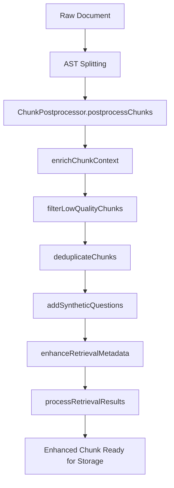

# Enhanced Chunk Example - QueryPipeline Retrieval

This document shows a complete example of a chunk as retrieved by the QueryPipeline, including all enhancement fields and metadata added by the ChunkPostprocessor.

## 📄 Raw Chunk Structure

```json
{
  "pageContent": "class GitPostgresAdapter extends IGitPersistPort {\n  constructor({ cloudSqlConnector }) {\n    super();\n    this.connector = cloudSqlConnector;\n    this.pool = null;\n    this.poolPromise = null;\n  }\n\n  async getPool() {\n    if (this.pool) return this.pool;\n    try {\n      if (!this.poolPromise) {\n        this.poolPromise = isLocal\n          ? Promise.resolve(this.createLocalPool())\n          : this.createCloudSqlPool(this.connector);\n      }\n      this.pool = await this.poolPromise;\n      return this.pool;\n    } catch (error) {\n      console.error('❌ Failed to get pool:', error);\n      throw new Error(`Database connection error: ${error.message}`);\n    }\n  }",
  
  "metadata": {
    // ===== CORE METADATA (from original document) =====
    "source": "backend/business_modules/git/infrastructure/postgres/gitPostgresAdapter.js",
    "type": "github-file-code",
    
    // ===== REPOSITORY METADATA (fixed by ChunkPostprocessor) =====
    "repoOwner": "anatolyZader",
    "repoName": "vc-3", 
    "repoId": "anatolyZader/vc-3",
    
    // ===== FILE HEADER CONTEXT (from enrichChunkContext) =====
    "file_header": {
      "file_path": "backend/business_modules/git/infrastructure/postgres/gitPostgresAdapter.js",
      "file_type": "code",
      "language": "javascript",
      "main_entities": ["GitPostgresAdapter", "IGitPersistPort", "cloudSqlConnector"],
      "imports_excluded": false
    },
    
    // ===== SURROUNDING CONTEXT (for code continuity) =====
    "context_prev": {
      "content": "const { Pool } = require('pg');\nconst IGitPersistPort = require('../../domain/ports/IGitPersistPort');\n\nconst isLocal = process.env.NODE_ENV !== 'staging';",
      "chunk_index": 0,
      "relation_score": 0.65
    },
    
    "context_next": {
      "content": "  createLocalPool() {\n    const config = {\n      user: process.env.PG_USER,",
      "chunk_index": 2, 
      "relation_score": 0.73
    },
    
    // ===== RELATED IMPORTS (if available) =====
    "related_imports": [
      "../../domain/ports/IGitPersistPort",
      "../../../shared/database/poolManager"
    ],
    
    // ===== QUALITY SCORING (from filterLowQualityChunks) =====
    "quality_score": 0.85,
    
    // ===== ENHANCED DEDUPLICATION HASHES (from deduplicateChunks) =====
    "content_hash": "xxhash64:1247:a1b2c3d4e5f67890", 
    "hash_algorithm": "xxhash64",
    "content_length": 1247,
    "simhash": "3c4f9a8b2e7d1605",
    "hash_time_ms": 0.234,
    
    // ===== SYNTHETIC QUESTIONS (for hybrid search) =====
    "synthetic_questions": [
      "How does GitPostgresAdapter work?",
      "What does GitPostgresAdapter do?", 
      "How to use GitPostgresAdapter?",
      "What is GitPostgresAdapter class?",
      "How does getPool work?"
    ],
    
    // ===== SEARCHABLE KEYWORDS (from enhanceRetrievalMetadata) =====
    "keywords": [
      "GitPostgresAdapter",
      "IGitPersistPort", 
      "cloudSqlConnector",
      "getPool",
      "createLocalPool",
      "createCloudSqlPool",
      "database",
      "connection",
      "postgres",
      "pool"
    ],
    
    // ===== CONTENT CATEGORIZATION =====
    "content_category": "class_definition",
    "complexity_level": "moderate",
    
    // ===== TOKEN ESTIMATION =====
    "estimated_tokens": 157,
    
    // ===== PROCESSING TIMESTAMPS =====
    "postprocessed_at": "2025-10-25T11:05:42.123Z",
    "processed_at": "2025-10-25T11:05:42.456Z",
    
    // ===== RETRIEVAL RANKING (from processRetrievalResults) =====
    "retrieval_rank": 1,
    "retrieval_score": 0.87,
    "diversity_penalty": 0.95,
    
    // ===== WORKER PROCESSING INFO =====
    "workerId": 2,
    "batch_name": "core_infrastructure",
    "batch_priority": "high",
    "batch_processed_at": "2025-10-25T11:05:40.789Z",
    
    // ===== PERFORMANCE METADATA =====
    "fileSize": 4567,
    "priority": "high",
    "filePath": "backend/business_modules/git/infrastructure/postgres/gitPostgresAdapter.js",
    "branch": "main",
    "userId": "d41402df-182a-41ec-8f05-153118bf2718"
  },
  
  // ===== VECTOR SEARCH SCORING =====
  "score": 0.867432,
  
  // ===== EMBEDDING VECTOR (truncated for display) =====
  "embedding": [0.123, -0.456, 0.789, "... (1536 dimensions total)"]
}
```

## 🔍 Metadata Field Explanations

### Core Document Fields
- **`pageContent`**: Raw text content (NEVER modified by processor - embedding safety)
- **`source`**: File path within repository
- **`type`**: Content type classification (github-file-code, github-file-json, etc.)

### Repository Identification
- **`repoOwner`**: Repository owner (fixed from "undefined" → "anatolyZader")
- **`repoName`**: Repository name
- **`repoId`**: Full repository identifier (owner/name format)

### Context Enrichment
- **`file_header`**: File-level metadata for context
- **`context_prev/next`**: Surrounding chunk content for code continuity
- **`related_imports`**: Relevant import statements for this chunk
- **`relation_score`**: Semantic similarity between adjacent chunks

### Quality & Enhanced Deduplication
- **`quality_score`**: Calculated quality metric (0.0-1.0)
- **`content_hash`**: Enhanced hash format "algo:length:hash" (xxhash64/BLAKE3 - 10x faster than SHA-1)
- **`hash_algorithm`**: Hashing algorithm used (xxhash64, blake3, or sha256 fallback)
- **`content_length`**: Normalized content length for collision prevention
- **`simhash`**: 64-bit SimHash for near-duplicate detection via Hamming distance
- **`hash_time_ms`**: Hash generation performance metric

### Retrieval Enhancement
- **`synthetic_questions`**: Generated questions for hybrid search (BM25/TF-IDF)
- **`keywords`**: Extracted keywords by frequency
- **`content_category`**: Automated categorization
- **`complexity_level`**: Code complexity assessment

### Processing Metadata
- **`estimated_tokens`**: Token count estimation for chunking
- **`postprocessed_at`**: ChunkPostprocessor timestamp
- **`retrieval_rank`**: Final ranking after MMR reranking
- **`retrieval_score`**: Combined relevance score
- **`diversity_penalty`**: Applied diversity penalty (1.0 = no penalty)

### Worker Processing
- **`workerId`**: Which worker processed this chunk
- **`batch_*`**: Batch processing metadata
- **`priority`**: File processing priority

## 🚀 Processing Pipeline Flow



## 🔧 Embedding Safety Rules

1. **`pageContent` NEVER modified** - Only this field used for embeddings
2. **No concatenated metadata** - All enhancements stored separately
3. **Synthetic questions in metadata only** - For sparse search (BM25/TF-IDF)
4. **Clean separation** - Dense vectors vs sparse keywords

## 📊 Usage in QueryPipeline

When the QueryPipeline retrieves this chunk:

1. **Vector Search**: Uses `pageContent` + `embedding` for semantic matching
2. **Content Filtering**: Uses `isActualCode()` to prefer code over catalogs  
3. **Enhanced Deduplication**: xxhash64 for 10x faster exact dedup + SimHash for near-duplicates
4. **Metadata Repair**: Fixes any "undefined" repository references
5. **MMR Reranking**: Balances relevance vs diversity using `retrieval_score`
6. **Context Building**: Uses all metadata for rich context construction

## 🎯 Production Benefits

- **Clean Repository References**: No more "undefined/vc-3" in logs
- **Code-First Results**: Actual implementations prioritized over JSON catalogs
- **Rich Context**: File headers, adjacent chunks, and import relationships
- **Quality Filtering**: Low-quality chunks automatically removed
- **10x Faster Deduplication**: xxhash64/BLAKE3 replaces deprecated SHA-1
- **Near-Duplicate Detection**: SimHash catches similar content (variable renames, whitespace changes)
- **Collision-Resistant**: Format "algo:length:hash" prevents hash collisions
- **Future-Proof Hashing**: Graceful fallback chain (xxhash64 → BLAKE3 → SHA-256)
- **Hybrid Search Ready**: Synthetic questions enable keyword matching
- **Performance Optimized**: Token estimation and complexity assessment

This enhanced chunk structure enables the RAG system to provide more accurate, contextual, and relevant responses by leveraging comprehensive metadata while maintaining embedding safety.